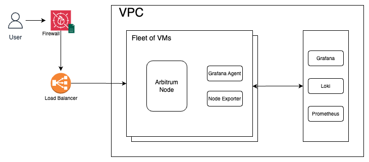

# Arbitrum Node Deployment
The repository contains an Ansible script designed to facilitate the deployment of an Arbitrum node for the Goerli network.

## Running Demo
Deployed at http://147.28.171.208:8547

Example:
```bash
$ curl -X POST -H "Content-Type: application/json" --data \
'{
  "jsonrpc": "2.0",
  "id": 1,
  "method": "eth_blockNumber",
  "params": []
}' http://147.28.171.208:8547
{"jsonrpc":"2.0","id":1,"result":"0x12a1"}
```

## Architecture

Proposed Architecture: High Level  Diagram

<p align="center"></p>

**Virtual Private Cloud (VPC)**: A secure VPC is set up to run fleet of VMs on which our Arbitrum node would be deployed.

Each VM would contain the following components:
- **Arbitrum Node:** node running on the Goerli rollup network, utilizing the [community-recommended approach](https://docs.arbitrum.io/node-running/how-tos/build-nitro-locally) through [Docker](https://docs.docker.com/).

- **Node Exporter:** exports node and machine-level metrics to Prometheus.

- **Grafana Agent:** collects logs and send them to Loki.

#### Monitoring Setup:
- **Prometheus:** collect & stores metrics from Arbitrum nodes.

- **Loki:** centralized log storage for efficient troubleshooting.

- **Grafana:** used to visualize/analyze logs and metrics from Loki and Prometheus.

A few important metrics that should be monitored:

**Node Metrics**:
- `chain_head_block`: last sync height of node
- `p2p_peers`: number of peers node is connected with

**RPC Metrics**:
- `arb_das_rpc_store_requests`: count of RPC Store calls
- `arb_das_rpc_store_success`: successful RPC Store calls
- `arb_das_rpc_store_failure`: failed RPC Store calls
- `arb_das_rpc_store_bytes`: bytes retrieved with RPC Store calls
- `arb_das_rpc_store_duration`: duration of RPC Store calls (p50, p75, p95, p99, p999, p9999)

**REST Metrics**:
- `arb_das_rest_getbyhash_requests`: count of REST GetByHash calls
- `arb_das_rest_getbyhash_success`: successful REST GetByHash calls
- `arb_das_rest_getbyhash_failure`: failed REST GetByHash calls
- `arb_das_rest_getbyhash_bytes`: bytes retrieved with REST GetByHash calls
- `arb_das_rest_getbyhash_duration`: duration of REST GetByHash calls (p50, p75, p95, p99, p999, p9999)

**Note**: this repository contains scripts to only setup the Arbitrum Nodes however, for production systems it is recommended to setup above mentioned logging & monitoring tools as well. 

## Setup

In this example Ansible has been used to deploy Arbitrum node on Virtual Machine.

#### Directory Structure

```plaintext
├── ansible-scripts
│   ├── hosts.ini
│   ├── playbook
│   │   └── playbook-setup-arbitrum.yaml
│   └── tasks
│       ├── arbitrum
│       │   └── setup.yml
│       └── common
│           ├── cleanup.yml
│           └── setup_docker.yml
└── 
```

- **hosts.ini:** provides necessary configurations for Ansible, including server IP, username, SSH key, etc.
- **playbook:** contains the set of tasks to be executed on remote hosts to set up the Arbitrum node.
- **tasks:**
  - **arbitrum:** 
    - **setup.yml:** contains tasks specific to the Arbitrum node setup.
  - **common:**
    - **cleanup.yml:** utility used for cleaning up outdated or obsolete dependencies.
    - **setup_docker.yml:** configures and sets up Docker.

**Prerequisites**:
- [Ansible](https://docs.ansible.com/ansible/latest/installation_guide/intro_installation.html) installed on the local machine
- Ensure you have SSH access to the Virtual Machine on which deployment needs to be done
- Add Goerli L1 Node Endpoint in [Arbitrum Service](./ansible-scripts/tasks/arbitrum/setup.yml) (check `<place-endpoint-here>`)
- Configure virtual machine details in [hosts.ini](./ansible-scripts/hosts.ini)
- (optional) Ensure you have correct node configurations for [Arbitrum Service](./ansible-scripts/tasks/arbitrum/setup.yml)

NOTE: _As per our experiences, we encountered issues with setting up VPC in the Mumbai region and hence shifted to Stockholm. Adjust your configurations accordingly._

**Deployment**:
```bash
$ cd ansible-scripts
$ ansible-playbook -i hosts.ini ./playbook/playbook-setup-arbitrum.yaml
```

**Testing**:
- Check if node is syncing:
```bash
$ curl -X POST -H "Content-Type: application/json" --data \
'{
  "jsonrpc": "2.0",
  "id": 1,
  "method": "eth_syncing",
  "params": []
}' http://localhost:8547
```

- Node Height:
```bash
$ curl -X POST -H "Content-Type: application/json" --data \
'{
  "jsonrpc": "2.0",
  "id": 1,
  "method": "eth_blockNumber",
  "params": []
}' http://localhost:8547
```

## Next Steps / Future Improvements

- Add support for logging & monitoring
- Implement load balancing and network firewalls
- Support to configure node dynamically via ansible variables
- Support snapshots during initial node setup